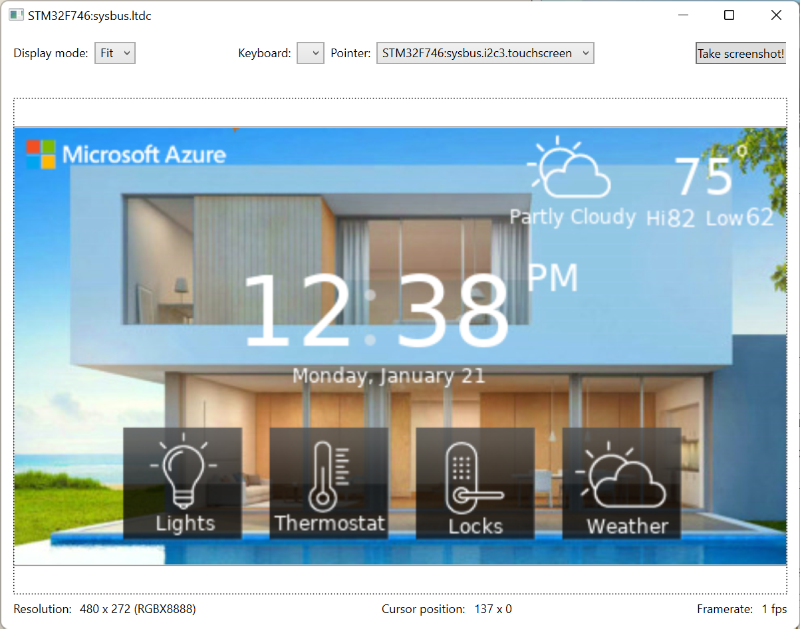

# Tests for Azure RTOS apps emulated in the Renode framework

This repostory contains a few samples showcasing Azure RTOS-based applications simulated and/or tested using the Renode framework.

## Azure RTOS ThreadX demo

You can launch the Azure RTOS Threadx "Hello World" demo for STM32F746G Discovery kit directly from the Renode REPL by issuing the following command: 

```
s @https://raw.githubusercontent.com/kartben/azure-rtos-renode-samples/master/stm32f746_azure_rtos_guix_home_automation.resc
```

The application binary will automatically download and the UART monitoring window will show the serial traces produced by the application.


## Azure RTOS GUIX Home Automation demo

You can launch the Azure RTOS GUIX Home Automation demo for STM32F746G Discovery kit directly from the Renode REPL by issuing the following command: 

```
s @https://raw.githubusercontent.com/kartben/azure-rtos-renode-samples/master/stm32f746_azure_rtos_guix_home_automation.resc
```

The application binary will automatically be downloaded and run, and you will be able to interact with the demo application through the simulated LCD touchscreen. 

\

## Using Robot Framework for testing

TBD.