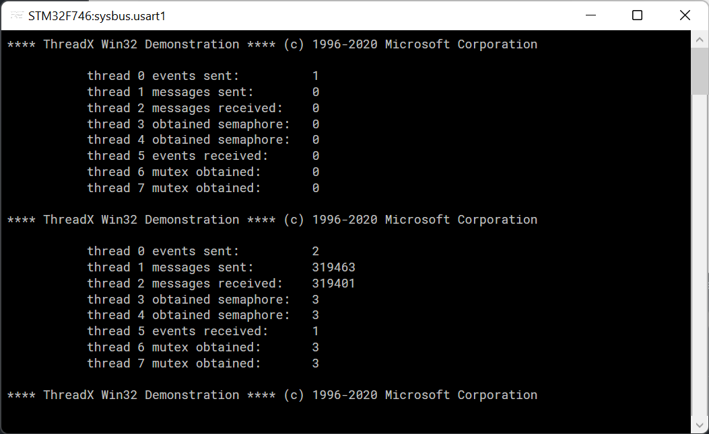
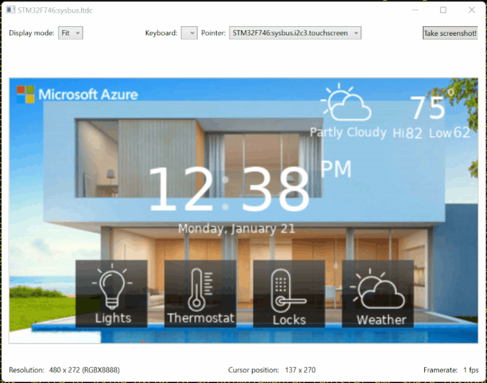
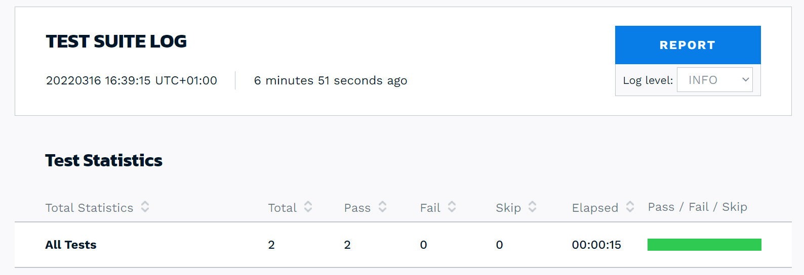

# Tests for Azure RTOS apps emulated in the Renode framework

This repository contains a few samples showcasing Azure RTOS-based applications simulated and/or tested using the Renode framework.

> :warning: Support for real-time operating systems on Arm chips in Renode has been vastly improved since Renode 1.12 release.
> 
> **You will need to use a nightly build** until Renode 1.13 is officially released. You can download the latest nightly build at [https://dl.antmicro.com/projects/renode/builds/?P=*latest*](https://dl.antmicro.com/projects/renode/builds/?P=*latest*).


## Azure RTOS ThreadX demo

You can launch the Azure RTOS Threadx "Hello World" demo for STM32F746G Discovery kit directly from the Renode REPL by issuing the following command: 

```
s @https://raw.githubusercontent.com/kartben/azure-rtos-renode-samples/master/stm32f746_azure_rtos_guix_home_automation.resc
```

The application binary will automatically download and the UART monitoring window will show the serial traces produced by the application.



## Azure RTOS GUIX Home Automation demo

You can launch the Azure RTOS GUIX Home Automation demo for STM32F746G Discovery kit directly from the Renode REPL by issuing the following command: 

```
s @https://raw.githubusercontent.com/kartben/azure-rtos-renode-samples/master/stm32f746_azure_rtos_guix_home_automation.resc
```

The application binary will automatically be downloaded and run, and you will be able to interact with the demo application through the simulated LCD touchscreen. 



## Using Robot Framework for testing

> :warning: As opposed to the samples above which can be automagically downloaded by Renode the first time you run them, you will need to locally clone this repository to run the following testing example.

```
renode-test stm32f746_threadx_demo.robot
```

The [test script](stm32f746_threadx_demo.robot) will run the Azure RTOS ThreadX demo and evaluate a few assertions to make sure it is working properly. For example, it will [check](stm32f746_threadx_demo.robot#L27-L57) if the RTOS scheduler works as it should, by checking the actual timers' intervals are accurate.

Once the test script completes, a complete report (look for `report.html` in your current folder) is generated. 


